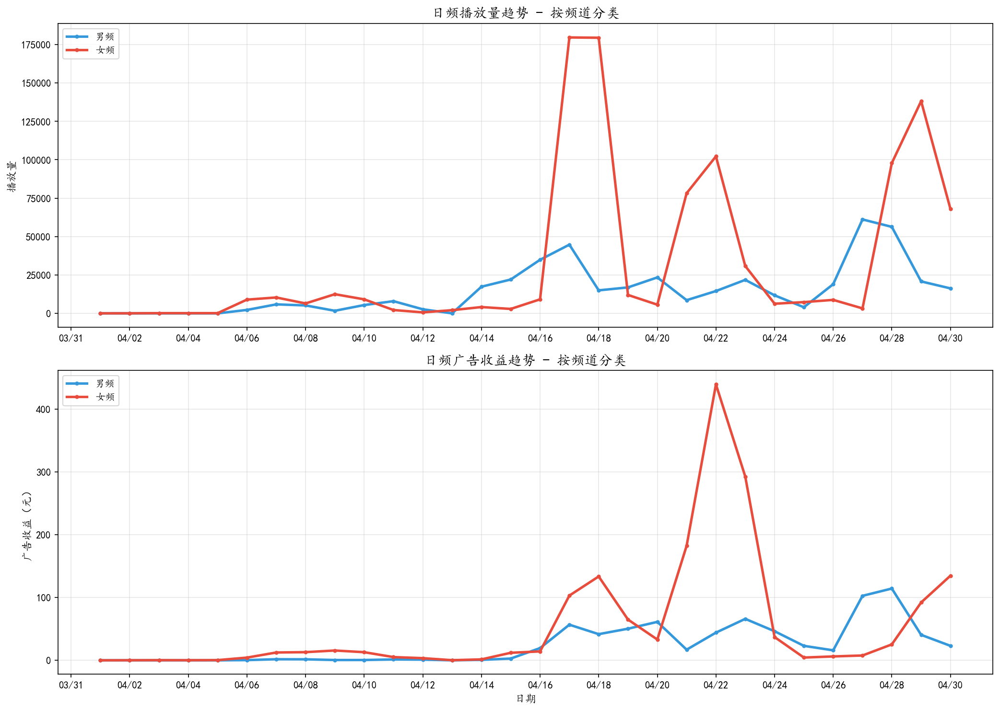
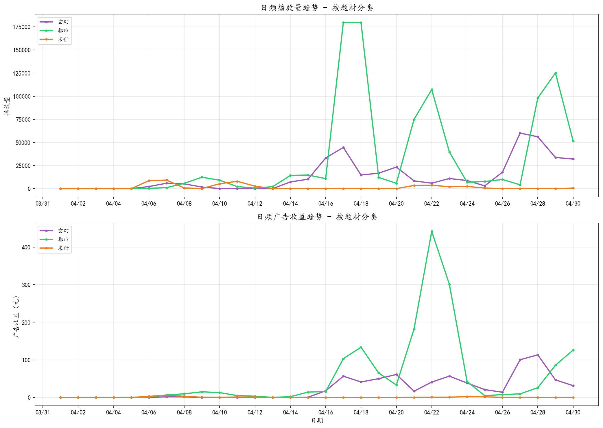

# 日频趋势

### 按频道分类

女频播放量与收益整体高于男频，两频道趋势基本同步。

### 按题材分类

都市题材占主导，玄幻次之，末世体量最小。

### 峰值分析

**4/17-4/18 流量高峰**：播放量分别达22.4万、19.4万，为日均的4-5倍，系爆款剧目集中放量所致；4/22收益峰值483元，为日均收益的6倍。

**月末回升（4/28-4/30）**：播放量回升至15.5万-15.9万区间，临近五一假期，用户活跃度提升。
